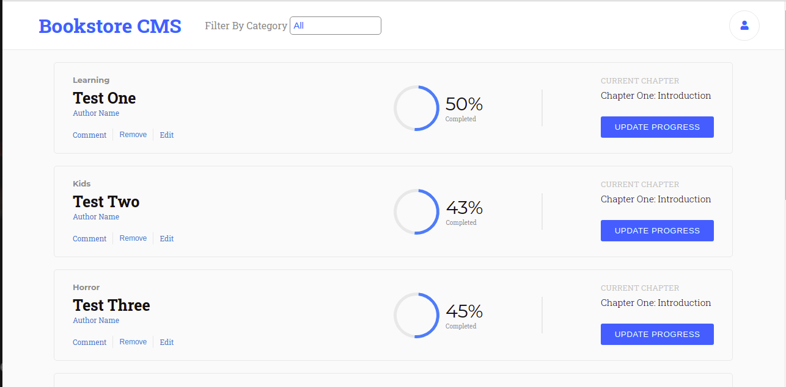

# Bookstore App

This is a bookstore application built by React and Redux.

 


# Live Link:
[Live Link](https://bookstore-amin-dev.herokuapp.com/)

# Built With
- JavaScript
- React
- Redux

 
## Setup

1. To run this project locally, please ensure you have npm installed.
2. Open the terminal.
3. Clone this repository by running:

```bash
git clone https://github.com/AhmedAmin90/bookstore-react-redux
```

4. To install the dependencies Open your terminal at the project folder: 

```bash
npm install
```

5. Start the server :

```bash
npm start
```

# How to Test:


## Authors

👤 **Ahmed Amin**

- GitHub: [@AhmedAmin90](https://github.com/AhmedAmin90)
- Twitter: [@AhmedAmin12383](https://twitter.com/AhmedAmin12383)
- LinkedIn: [Ahmed Amin](https://www.linkedin.com/in/web-developer/)


## 🤝 Contributing

Contributions, issues, and feature requests are welcome!

Feel free to check the [issues page]((https://github.com/AhmedAmin90/bookstore-react-redux/issues)).

## Show your support

Give a ⭐️ if you like this project!

## License
<p>This project is <a href="./LICENSE">MIT</a> licensed.</p>